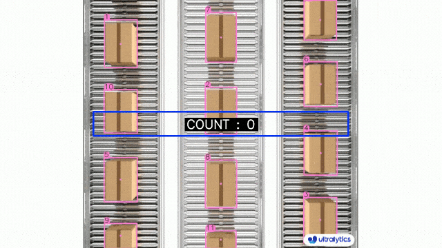
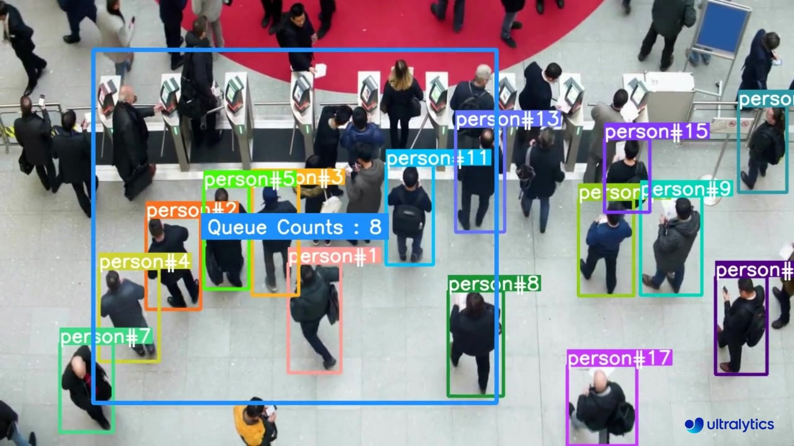
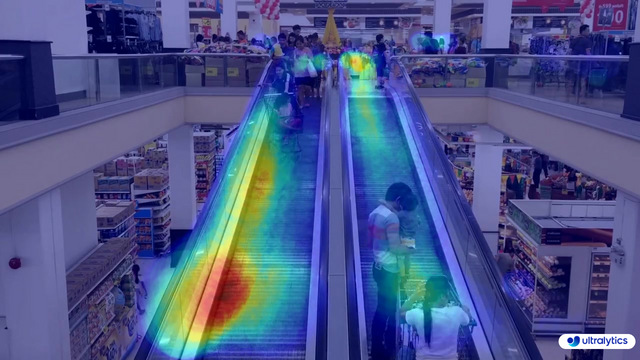

# Proyecto: Análisis de flujo peatonal

## Índice de Contenidos
1. [Introducción](#1-introducción)
   1. [Descripción del Problema](#11-descripción-del-problema)
   2. [Fuentes de Datos](#12-fuentes-de-datos)
2. [Objetivos del Proyecto](#2-objetivos-del-proyecto)
   1. [Objetivos Generales](#21-objetivos-generales)
   2. [Objetivos Específicos](#22-objetivos-específicos)
3. [Metodologías y Técnicas Utilizadas](#3-metodologías-y-técnicas-utilizadas)
   1. [Metodologías](#31-metodologías)
   2. [Análisis y Modelado de Datos](#32-análisis-y-modelado-de-datos)
   3. [Técnicas y Tecnologías](#33-técnicas-y-tecnologías)
   4. [Herramientas de Desarrollo y Control del Proyecto](#34-herramientas-de-desarrollo-y-control-del-proyecto)
4. [Aplicación y Resultados](#4-aplicación-y-resultados)
5. [Limitaciones del Proyecto y Sugerencias de Mejora](#5-limitaciones-del-proyecto-y-sugerencias-de-mejora)
   1. [Limitaciones del Proyecto](#51-limitaciones-del-proyecto)
   2. [Sugerencias de Mejora](#52-sugerencias-de-mejora)
6. [Análisis Crítico del Proyecto](#6-análisis-crítico-del-proyecto)
   1. [Fortalezas](#61-fortalezas)
   2. [Debilidades](#62-debilidades)
   3. [Cómo se Han Abordado las Limitaciones](#63-cómo-se-han-abordado-las-limitaciones)
7. [Explicaciones Adicionales](#7-explicaciones-adicionales)
8. [Conclusión Final](#8-conclusión-final)
9. [Referencias](#9-referencias)
10. [Autores](#10-autores)


## 1. Introducción
### 1.1. Descripción del Problema

En las ciudades modernas, la gestión eficiente del flujo peatonal es crucial para mejorar la infraestructura y los servicios urbanos. Este proyecto aborda la necesidad de monitorear y analizar en tiempo real el movimiento de personas en diversos espacios públicos, como plazas, calles concurridas y edificios públicos, utilizando técnicas avanzadas de detección y seguimiento.

La congestión peatonal en áreas urbanas no solo afecta la comodidad y seguridad de los ciudadanos, sino que también puede obstaculizar el comercio y el tránsito. Para abordar estos desafíos, se necesita una solución que permita detectar y seguir a las personas en tiempo real, predecir sus trayectorias y analizar los patrones de movimiento.

Este proyecto desarrolla un sistema basado en YOLOv8 y DeepSort para la detección y el seguimiento de personas. Además, se protege la privacidad de los individuos mediante el difuminado de rostros y se almacena la información de seguimiento en sistemas de almacenamiento modernos como Azure y MongoDB, facilitando el análisis del flujo peatonal para mejorar la planificación urbana.

### 1.2. Fuentes de Datos

#### Datos en Tiempo Real de Cámaras de Vigilancia
- **Fuente de Datos:** Cámaras de vigilancia ubicadas en diversos espacios públicos de la ciudad, incluyendo plazas, calles concurridas y edificios públicos.
- **Obtención de Datos:** Los datos se obtienen en tiempo real mediante un sistema de cámaras de vigilancia conectadas a la red municipal.
- **Preprocesamiento de Datos:**
  - **Detección de Personas:** Utilizando YOLOv8 para identificar personas en cada frame capturado por las cámaras.
  - **Seguimiento de Personas:** Implementación de DeepSort para rastrear el movimiento de cada individuo.
  - **Protección de Datos:** Difuminado de rostros para asegurar la privacidad de las personas detectadas.
  - **Almacenamiento Temporal:** Los datos procesados se envían a una cola de RabbitMQ.
  - **Persistencia de Datos:** Uso de Apache NiFi para procesar los datos de RabbitMQ y generar un CSV almacenado en Azure, y un JSON almacenado en MongoDB.

Los datos incluyen la siguiente información por cada frame y persona detectada:

```python
data = {
    "track_id": track.track_id,
    "conf": track.det_conf,
    "cord_x": int((box[0] + box[2]) / 2),
    "cord_y": int((box[1] + box[3]) / 2),
    "mean": track.mean.tolist(),
    "hits": track.hits,
    "age": track.age,
    "time_since_update": track.time_since_update,
    "state": track.state,
    "time": datetime.datetime.now().timestamp()
}
```

## 2. Objetivos del Proyecto

### 2.1. Objetivos Generales
- Mejorar la gestión del flujo peatonal en espacios públicos urbanos mediante el análisis de datos en tiempo real.
- Proteger la privacidad de los individuos mediante el difuminado de rostros en las imágenes capturadas.

### 2.2. Objetivos Específicos

- [x] **Desarrollo del Sistema de Detección y Seguimiento:**
  - [x] **Implementación de Detección de Personas:** Utilizar YOLOv8, una técnica de IA avanzada para la detección en tiempo real de personas en imágenes capturadas por cámaras de vigilancia. Este modelo de detección es altamente eficiente y preciso, permitiendo identificar y localizar a las personas en cada frame de vídeo.
  - [x] **Seguimiento de Personas:** Implementar DeepSort, un algoritmo de seguimiento que permite rastrear el movimiento de cada individuo de manera continua a través de múltiples frames. DeepSort utiliza técnicas de IA para asociar detecciones en diferentes frames, manteniendo un seguimiento preciso y consistente.


- [x] **Protección de Datos Personales:**
  - [x] **Difuminado de Rostros:** Implementar técnicas de procesamiento de imagen para el difuminado automático de rostros, asegurando la privacidad de los individuos detectados. Esta técnica es crucial para cumplir con las normativas de protección de datos y privacidad.


- [x] **Almacenamiento y Procesamiento de Datos:**
  - [x] **Gestión de Mensajes con RabbitMQ:** Configurar RabbitMQ para gestionar las colas de mensajes que contienen los datos de seguimiento en tiempo real. RabbitMQ permite manejar eficientemente grandes volúmenes de datos, asegurando su entrega confiable y ordenada.
  - [x] **Procesamiento de Datos con Apache NiFi:** Utilizar Apache NiFi para procesar y transformar los datos recibidos de RabbitMQ. Este procesamiento incluye la generación de archivos CSV y JSON, facilitando una organización estructurada de la información.
  - [x] **Almacenamiento en Azure y MongoDB:** Almacenar los archivos CSV en Azure para su análisis posterior y los archivos JSON en MongoDB, una base de datos NoSQL que permite un acceso rápido y flexible a los datos.


- [ ] **Análisis del Flujo Peatonal y Predicción de Trayectorias:**
  - [x] **Patrones de Movimiento y Trayectorias:** Analizar en tiempo real los patrones de movimiento y las trayectorias de las personas utilizando DeepSort y Yolov8. Este análisis puede identificar áreas de alta congestión y sugerir mejoras en la infraestructura urbana.
  - [ ] **Desarrollo de Modelos Predictivos:** Utilizar técnicas de aprendizaje automático para desarrollar modelos que anticipen las trayectorias de las personas basándose en los datos históricos. Esto puede ayudar a prever y mitigar problemas de congestión peatonal.
  - [ ] **Modelos:**
    - [x] **Clustering:** Identificar patrones de agrupación en el flujo peatonal para mejorar la planificación urbana.
    - [ ] **Series Temporales:** Analizar tendencias y patrones temporales en el movimiento de personas para anticipar cambios en el flujo peatonal.
    - [ ] **No Supervisado:** Descubrir patrones ocultos en los datos de seguimiento de personas sin la necesidad de etiquetas para comprender mejor el comportamiento urbano.
    - [x] **Clasificación:** Identificar diferentes categorías de comportamiento en el flujo peatonal para mejorar la segmentación y el análisis.
    - [ ] **Regresión:** Predecir valores continuos relacionados con el flujo peatonal para mejorar la planificación y gestión urbana.


- [ ] **Mejora Continua y Escalabilidad:**
  - [ ] **Evaluación y Optimización del Sistema:** Evaluar el rendimiento del sistema mediante métricas específicas y proponer mejoras continuas para asegurar su eficiencia.
  - [ ] **Escalabilidad:** Asegurar que el sistema pueda escalarse para adaptarse a diferentes entornos urbanos y a volúmenes variables de datos, garantizando su aplicabilidad amplia y robusta.


## 3. Metodologías y Técnicas Utilizadas

### 3.1. Metodologías
- **Metodología Ágil/Kanban:**
  - Se utilizó una metodología ágil con un enfoque Kanban para el desarrollo del proyecto. Esta metodología permitió una mayor flexibilidad y capacidad de adaptación a los cambios y mejoras continuas.
  - **Herramientas de Gestión de Proyectos:**
    - Gitea se utilizó para la gestión del código fuente y versiones, facilitando la colaboración y el seguimiento de cambios en el proyecto.
    - Tableros Kanban mediante Gitea para la gestión de tareas, proporcionando visibilidad y control sobre el progreso del proyecto.

### 3.2. Análisis y Modelado de Datos
- **Clustering:** Identificación de patrones de agrupación en el flujo peatonal.
- **Series Temporales:** Análisis de tendencias y patrones temporales en el movimiento de personas.
- **No Supervisado:** Descubrimiento de patrones ocultos en los datos sin la necesidad de etiquetas.
- **Clasificación:** Identificación de diferentes categorías de comportamiento en el flujo peatonal.
- **Regresión:** Predicción de valores continuos relacionados con el flujo peatonal.


### 3.3. Técnicas y Tecnologías

- **Detección y Seguimiento de Personas:**
  - **YOLOv8 para Detección de Personas:**
    - YOLOv8 (You Only Look Once, versión 8) es una técnica avanzada de detección de objetos que permite identificar a las personas en tiempo real a partir de las imágenes capturadas por cámaras de vigilancia. Su arquitectura eficiente y precisa asegura una detección rápida y confiable en cada frame de vídeo.
  - **Servidor de WebSockets para Transmisión de Datos:**
    - Se emplea un servidor de WebSockets para la transmisión de datos entre los diferentes componentes del sistema. Esta tecnología de comunicación bidireccional y en tiempo real facilita la integración fluida de los procesos de detección y seguimiento, garantizando una sincronización precisa de la información.
  - **DeepSort para Seguimiento de Personas:**
    - DeepSort es un algoritmo de seguimiento que asocia detecciones de personas en múltiples frames, manteniendo una pista consistente de cada individuo. Utiliza redes neuronales para la extracción de características y un filtro de Kalman para la predicción de estados futuros, permitiendo un seguimiento preciso y continuo.


- **Protección de Datos Personales:**
  - **Difuminado de Rostros:**
    - Utilizamos YOLOv8-face para detectar y difuminar automáticamente los rostros de las personas detectadas, protegiendo así su privacidad. YOLOv8-face es una variante especializada en la detección de rostros, lo que permite una identificación precisa y eficiente de las áreas que necesitan ser difuminadas. Las técnicas de procesamiento de imagen, implementadas mediante OpenCV y otros algoritmos específicos, aseguran que los rostros sean difuminados de manera efectiva.


- **Gestión y Procesamiento de Datos:**
  - **RabbitMQ para la Gestión de Mensajes:**
    - RabbitMQ se configuró para manejar las colas de mensajes que contienen los datos de seguimiento en tiempo real. Esta herramienta de mensajería asincrónica asegura la entrega confiable y ordenada de grandes volúmenes de información, facilitando la comunicación entre los diferentes componentes del sistema.
  - **Apache NiFi para el Procesamiento de Datos:**
    - Apache NiFi se empleó para procesar y transformar los datos recibidos de RabbitMQ. Este procesamiento incluye la limpieza, normalización y enriquecimiento de los datos, generando archivos CSV y JSON para su análisis posterior.
  - **Almacenamiento en Azure y MongoDB:**
    - Los archivos CSV se almacenaron en Azure Blob Storage, proporcionando acceso seguro y escalable a los datos. Los archivos JSON se almacenaron en MongoDB, una base de datos NoSQL que ofrece acceso rápido y flexible a los datos estructurados en formato JSON.

### 3.4. Herramientas de Desarrollo y Control del Proyecto
- **Docker:**
  - Docker se utilizó para crear contenedores que alojan las distintas partes del sistema, asegurando que el entorno de desarrollo y producción sean consistentes y fáciles de gestionar.
- **Gitea:**
  - Gitea se utilizó para gestionar el repositorio del código del proyecto, facilitando la colaboración y el control de versiones.
- **LunarVIM y PyCharm:**
  - LunarVIM y PyCharm fueron los entornos de desarrollo integrados (IDE) utilizados. LunarVIM, un IDE basado en Vim, proporcionó una experiencia de edición avanzada y eficiente, mientras que PyCharm ofreció un entorno robusto y altamente configurable para el desarrollo en Python.
- **Sistema Operativo Arch Linux:**
  - Arch Linux, conocido por su simplicidad y personalización, fue el sistema operativo escogido para el desarrollo del proyecto. Su flexibilidad permitió una configuración precisa del entorno de desarrollo según las necesidades del proyecto.


### 4. Aplicación y Resultados
- **Implementación de Técnicas:**
  - Se implementaron y ajustaron YOLOv8 y DeepSort para la detección y seguimiento en tiempo real de personas en imágenes de vigilancia. Estos algoritmos se integraron con el sistema de video vigilancia existente, permitiendo la detección y seguimiento eficientes.
  - El módulo de difuminado de rostros se desarrolló para asegurar la privacidad durante el proceso de detección y seguimiento.
  - RabbitMQ y Apache NiFi se configuraron para manejar y procesar los datos, asegurando una transmisión y transformación de datos eficiente y segura.


- **Resultados Obtenidos:**
  - La implementación de YOLOv8 y DeepSort logró una detección y seguimiento precisos de personas en diferentes entornos urbanos. La privacidad de los individuos fue protegida eficientemente mediante el difuminado de rostros.
  - El sistema de almacenamiento basado en Azure y MongoDB permitió una gestión estructurada y escalable de los datos.
  - [//]: # (TODO - [ ] Los reportes y visualizaciones generados mediante PowerBI, o dashboard, facilitaron análisis detallados del flujo peatonal, proporcionando información valiosa para la toma de decisiones sobre la infraestructura urbana.)


## 5. Limitaciones del Proyecto y Sugerencias de Mejora

### 5.1. Limitaciones del Proyecto
- **Datos de Entrenamiento No Reales:**
   - **Limitación:** No disponemos de cámaras reales para la captura de datos en vivo, por lo que las pruebas se están realizando con videos de YouTube. Esto limita la precisión del análisis, ya que no se está trabajando con datos 100% reales.
   - **Sugerencia de Mejora:** Implementar un sistema de cámaras en tiempo real en varias ubicaciones urbanas para obtener datos auténticos y relevantes.


- **Capacidad de Procesamiento:**
   - **Limitación:** Aunque el programa está preparado para utilizar CUDA si está disponible, los videos largos o múltiples tareas pueden causar ralentizaciones significativas.
   - **Sugerencia de Mejora:** Optimizar los algoritmos para ser menos demandantes en términos de recursos computacionales. Considerar el uso de hardware acelerado, como GPUs más potentes, para mejorar el rendimiento. También se podría investigar el uso de técnicas de procesamiento distribuido.


- **Precisión en la Detección de Rostros:**
   - **Limitación:** El difuminado de rostros no es perfecto y, en algunos casos, no detecta correctamente las caras, lo que compromete la protección de la privacidad.
   - **Sugerencia de Mejora:** Mejorar los modelos de detección de rostros, posiblemente entrenando con conjuntos de datos más amplios y diversos. Incorporar técnicas de post-procesamiento para aumentar la precisión del difuminado.


### 5.2. Sugerencias de Mejora
- **Contar el Número de Personas que Entran y Salen:**
   - **Mejora Propuesta:** Implementar un sistema de conteo de personas que entran y salen de áreas específicas, utilizando modelos de detección y seguimiento mejorados para identificar las entradas y salidas de personas en tiempo real.

        


- **Detección de Agrupaciones de Gente:**
   - **Mejora Propuesta:** Desarrollar algoritmos que identifiquen y analicen la formación de agrupaciones de personas, lo cual puede ser útil para gestionar eventos públicos y responder a emergencias.

        


- **Detección de Colas:**
   - **Mejora Propuesta:** Implementar técnicas de visión por computadora para detectar y analizar la formación de colas en tiempo real, ayudando a mejorar la gestión del espacio y reducir los tiempos de espera.

        


- **Implementación de Heatmaps:**
   - **Mejora Propuesta:** Añadir la funcionalidad de generar mapas de calor (heatmaps) para visualizar las áreas de mayor concentración de personas y patrones de movimiento, lo que facilitaría la toma de decisiones en la planificación urbana.

        

- **Mejora de los Algoritmos Utilizados:**
   - **Mejora Propuesta:** Investigar y aplicar versiones más avanzadas de YOLO (como YOLOv8) y explorar otros algoritmos de seguimiento más sofisticados para mejorar la precisión y eficiencia del sistema.


## 6. Análisis Crítico del Proyecto

### 6.1. Fortalezas
- **Integración de Tecnologías Avanzadas:**
   - Uso de YOLOv8 para la detección precisa de personas y DeepSort para el seguimiento eficiente.
   - Implementación de técnicas avanzadas de procesamiento de datos con RabbitMQ y Apache NiFi.
   - Almacenamiento robusto y flexible en Azure y MongoDB.

- **Enfoque en la Privacidad:**
   - Implementación efectiva del difuminado de rostros para proteger la privacidad de los individuos.

- **Capacidad de Escalabilidad:**
   - Diseño del sistema para permitir la escalabilidad y adaptación a diferentes entornos urbanos.

### 6.2. Debilidades
- **Datos de Entrenamiento No Reales:**
   - Las pruebas se están realizando con videos de YouTube, lo que limita la precisión del análisis al no trabajar con datos 100% reales.

- **Dependencia de Recursos Computacionales:**
   - Aunque se usa CUDA, los videos largos o múltiples tareas pueden causar ralentizaciones significativas.

- **Precisión en la Detección de Rostros:**
   - La precisión del difuminado de rostros no es perfecta y puede fallar en algunos casos.


- **Limitaciones en la Adaptabilidad:**
   - Cada cámara tiene un campo de visión único, y los objetos y personas en esa visión pueden variar ampliamente, lo que agrega complejidad al proyecto al requerir configuraciones personalizadas para cada ubicación.

### 6.3. Cómo se Han Abordado las Limitaciones
- **Optimización del Código:**
   - **Mejora de Funciones de Detección y Seguimiento: Se han optimizado las funciones utilizadas para detectar personas y mantener un seguimiento continuo de las mismas, mejorando así la eficiencia del sistema sin necesidad de modificar el algoritmo base.


- **Entrenamiento de Modelos:**
   - **Uso de Conjuntos de Datos Diversos:** A pesar de las limitaciones, se ha entrenado a los modelos con conjuntos de datos lo más diversos posibles para mejorar la precisión en diferentes escenarios.


- **Evaluación Continua:**
   - **Pruebas y Ajustes:** Se han realizado pruebas constantes y ajustes en el sistema para mejorar su rendimiento y precisión, identificando áreas clave para futuras mejoras.


- **Consideraciones para el Futuro:**
   - **Instalación de Cámaras Reales:** Una de las principales sugerencias es la implementación de cámaras reales en entornos urbanos para obtener datos auténticos y relevantes, mejorando así la precisión del análisis.
   - **Mejora del Difuminado de Rostros:** Se sugiere mejorar los algoritmos de detección de rostros, posiblemente entrenándolos con conjuntos de datos más amplios y diversos para aumentar la precisión del difuminado.

## 7. Explicaciones adicionales

- **[Despligue del proyecto](docs/Despliegue.md)**

- **[Detalles sobre websocket Yolo para detectar personas](docs/WebSocketYolo.md)**

- **[Configuración y Uso de RabbitMQ y Apache NiFi](docs/RabbitNifi.md)**

- **[Configuración y Uso de Azure](docs/Azure.md)**

- **[Modelos y Notebooks](docs/Modelos.md)**


## 8. Conclusión Final
[//]: # (TODO Conclusion)
- [ ] Resumen claro y conciso de los principales resultados obtenidos en el proyecto. (#30)
- [ ] Reflexión crítica sobre el proceso de investigación y la aplicación de las técnicas de Big Data e Inteligencia Artificial utilizadas. (#30)
- [ ] Identificación de las limitaciones del proyecto y sugerencias para futuras investigaciones. (#30)
- [ ] Implicaciones prácticas de los resultados obtenidos en el proyecto y su potencial impacto en las "Smart Cities". (#30)

## 9. Referencias
- YOLOv8n: [Link to the official repository](https://github.com/ultralytics/ultralytics)
- YOLOv8n-faces [Link to the repository](https://github.com/akanametov/yolov8-face)
- Python Documentation: [Official website](https://docs.python.org/3/)
- Reflex Documentation: [Official website](https://reflex.dev/)
- RabbitMQ Documentation: [Official website](https://www.rabbitmq.com/)
- Nifi Documentation: [Official website](https://nifi.apache.org/)
- MongoDB Documentation: [Official website](https://www.mongodb.com/es)


## 10. Autores

- Sergio Gimeno
- Michael Ballester
