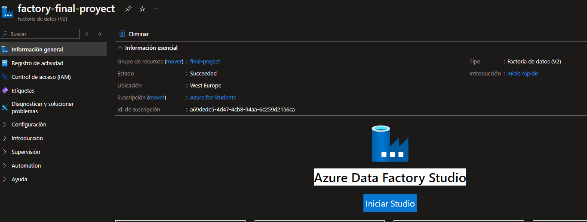
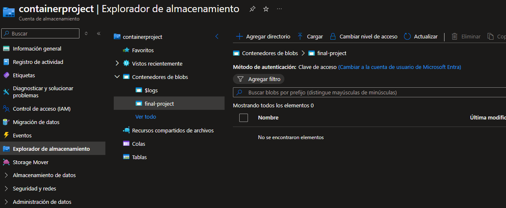
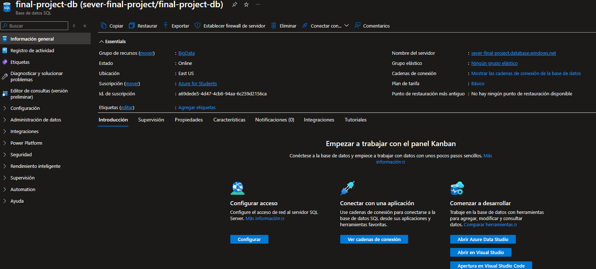
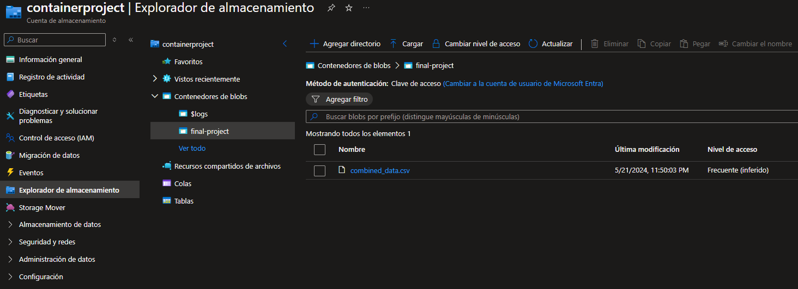
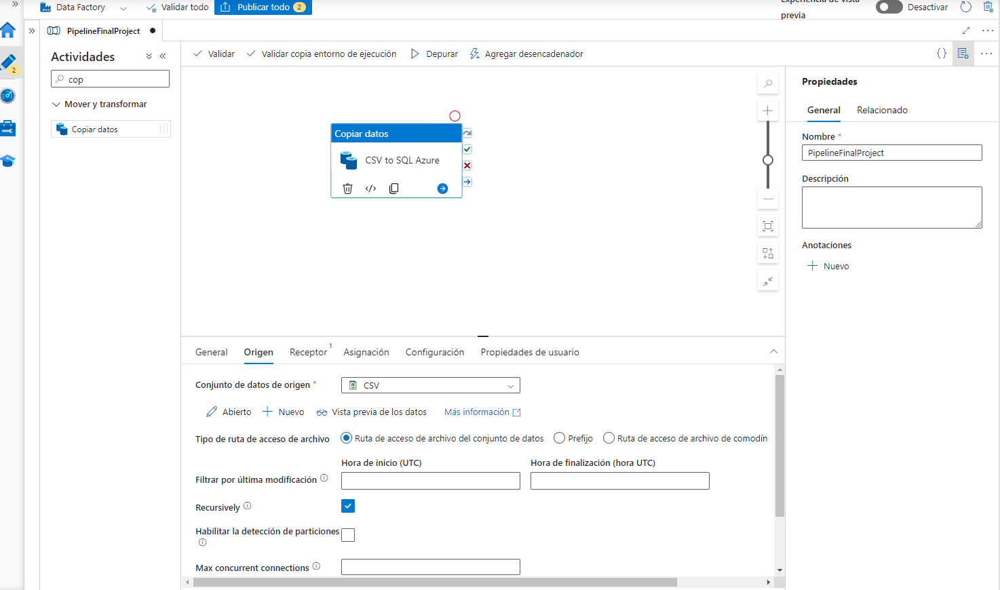
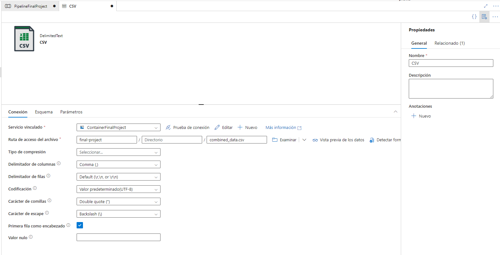
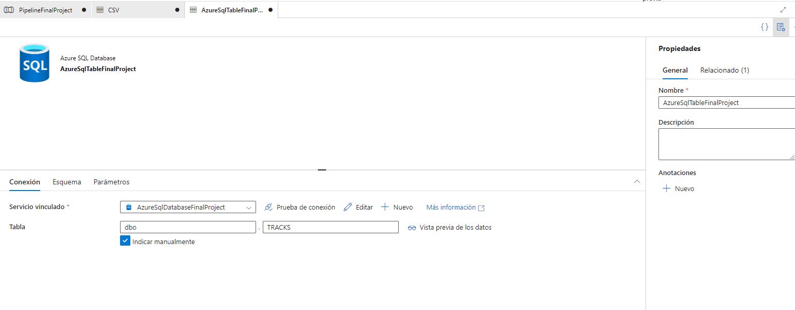
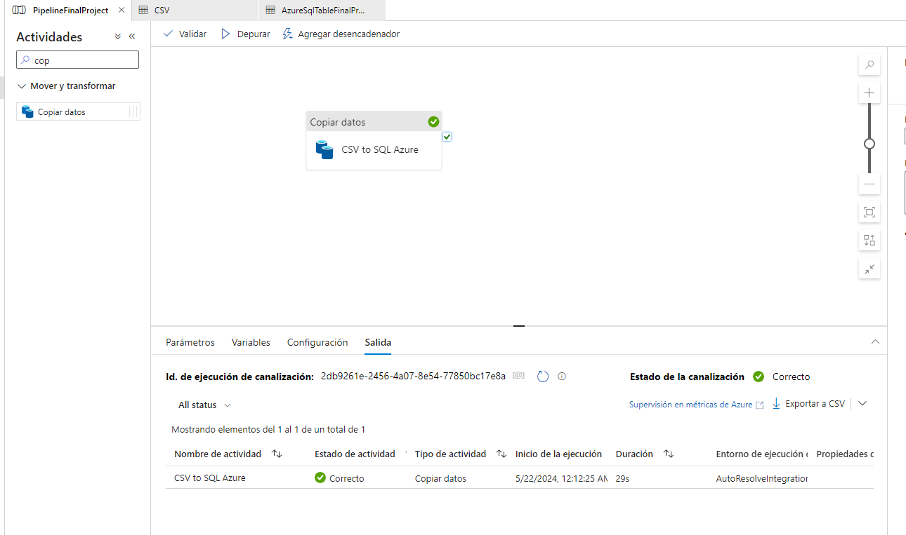
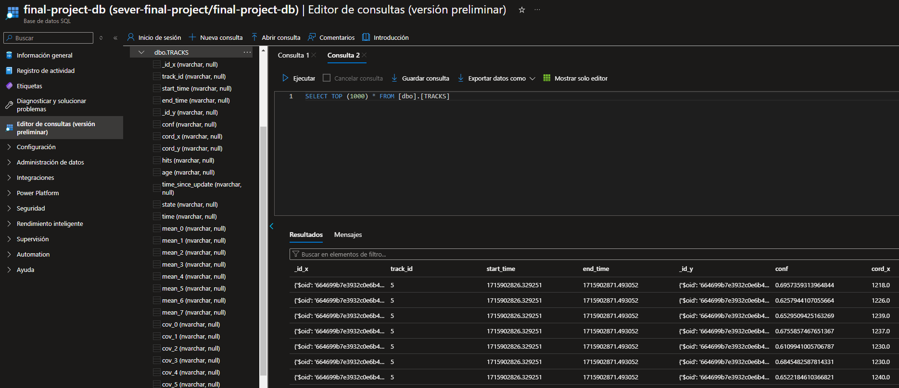

# Big Data - Azure

## Creación del Data Factory



## Creación de una cuenta de almacenamiento (Storage Account)

En este paso, creamos una cuenta de almacenamiento en Azure para almacenar nuestros archivos, como el CSV que vamos a
cargar. Esta cuenta de almacenamiento actúa como un contenedor seguro para nuestros datos, accesible desde cualquier
lugar.



## Creación de una base de datos SQL de Azure



## Subida de un archivo CSV desde Python

En este fragmento de código Python, subimos un archivo CSV a nuestro contenedor en Azure Blob Storage. Utilizamos la
biblioteca azure.storage.blob para interactuar con el almacenamiento de blobs en Azure. Después de abrir el archivo CSV
localmente, lo cargamos en el contenedor especificado en Azure.

```python
from azure.storage.blob import BlobServiceClient
import pandas as pd

blob_service_client = BlobServiceClient.from_connection_string("Tu cadena de conexión")

container_name = "nombre_del_contenedor"

csv_file_path = "data/combined_data.csv"

blob_name = "combined_data.csv"

with open(csv_file_path, "rb") as data:
    blob_client = blob_service_client.get_blob_client(container=container_name, blob=blob_name)
    blob_client.upload_blob(data)

```



## Creación de un pipeline en el Data Factory



### Origen: CSV almacenado en el Storage



### Destino: Base de datos SQL de Azure



### Ejecución del pipeline



### Resultado



## Definición JSON del pipeline

En este JSON, definimos un pipeline en Azure Data Factory para copiar datos del CSV al SQL de Azure. Este pipeline
incluye una actividad de copia que especifica cómo se deben mover los datos, como la ubicación del origen (CSV) y del
destino (SQL de Azure), así como opciones de configuración como la creación automática de tablas.

```json
{
    "name": "PipelineFinalProject",
    "properties": {
        "activities": [
            {
                "name": "CSV to SQL Azure",
                "type": "Copy",
                "dependsOn": [],
                "policy": {
                    "timeout": "0.12:00:00",
                    "retry": 0,
                    "retryIntervalInSeconds": 30,
                    "secureOutput": false,
                    "secureInput": false
                },
                "userProperties": [],
                "typeProperties": {
                    "source": {
                        "type": "DelimitedTextSource",
                        "storeSettings": {
                            "type": "AzureBlobStorageReadSettings",
                            "recursive": true,
                            "enablePartitionDiscovery": false
                        },
                        "formatSettings": {
                            "type": "DelimitedTextReadSettings"
                        }
                    },
                    "sink": {
                        "type": "AzureSqlSink",
                        "writeBehavior": "insert",
                        "sqlWriterUseTableLock": false,
                        "tableOption": "autoCreate",
                        "disableMetricsCollection": false
                    },
                    "enableStaging": false,
                    "translator": {
                        "type": "TabularTranslator",
                        "typeConversion": true,
                        "typeConversionSettings": {
                            "allowDataTruncation": true,
                            "treatBooleanAsNumber": false
                        }
                    }
                },
                "inputs": [
                    {
                        "referenceName": "CSV",
                        "type": "DatasetReference"
                    }
                ],
                "outputs": [
                    {
                        "referenceName": "AzureSqlTableFinalProject",
                        "type": "DatasetReference"
                    }
                ]
            }
        ],
        "annotations": []
    }
}
