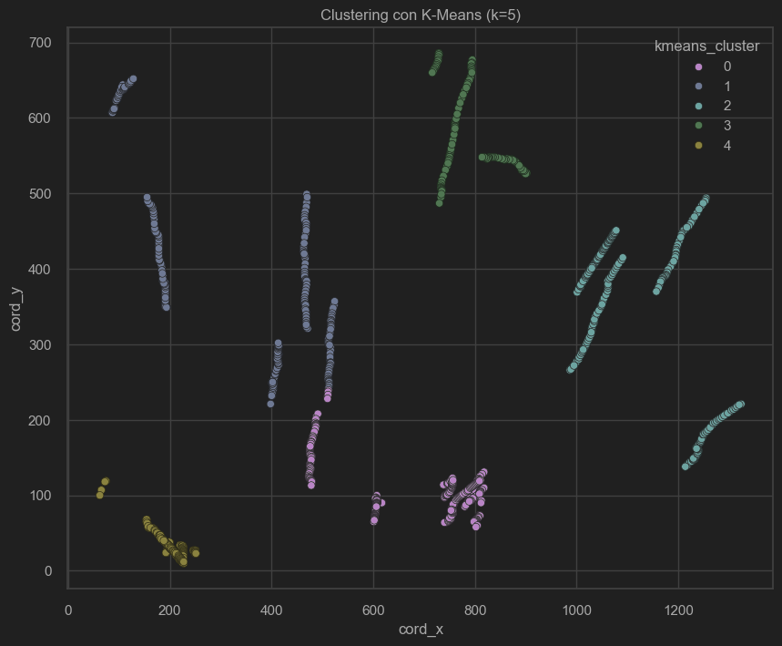

# Noteboks - Modelos

## Notebook: `prepare_data.ipynb`

### Objetivo

El objetivo de este notebook es preparar los datos almacenados en archivos JSON para su uso en modelos de aprendizaje
automático. Los datos provienen de dos archivos JSON: uno contiene información de las
personas (`proyecto_ia_arch.persons.json`) y el otro contiene información de las
pistas (`proyecto_ia_arch.tracks.json`).

### Pasos Realizados

1. **Cargar Archivos JSON**:
    - Se cargan los archivos JSON utilizando la función `read_data_from_json`.
    - Archivos cargados: `persons_file` y `tracks_file`.

2. **Procesar Datos de las Pistas**:
    - Se crea un DataFrame a partir de los datos de las pistas.
    - Se expanden las columnas `mean` y `covariance` en múltiples columnas separadas.
    - Se eliminan las columnas originales `mean` y `covariance`.

3. **Guardar Datos Combinados**:
    - Se combinan los DataFrames de personas y pistas utilizando la columna `track_id`.

## Notebook: `eda.ipynb`

### Objetivo

El objetivo de este notebook es realizar un análisis exploratorio de datos (EDA) en el archivo CSV generado en el
notebook de preparación de datos (`combined_data.csv`). El EDA ayuda a entender las características de los datos y a
identificar patrones y relaciones importantes.

### Pasos Realizados

1. **Cargar Datos Combinados**:
    - Se carga el archivo CSV `combined_data.csv` en un DataFrame para su análisis.

2. **Eliminar Columnas No Útiles**:
    - Se eliminan las columnas que no son relevantes para el análisis, tales
      como `'_id_x'`, `'_id_y'`, `start_time`, `end_time`, `conf`, `hits`, `age`, `time_since_update`, `state`,
      y `time`.

3. **Mostrar Información del DataFrame**:
    - Se muestran las primeras filas del DataFrame para obtener una vista general de los datos.
    - Se proporciona información detallada del DataFrame, incluyendo tipos de datos y valores nulos.
    - Se generan estadísticas descriptivas de las variables numéricas.

4. **Visualización de Distribuciones**:
    - Se crean gráficos de distribución para las coordenadas `cord_x` y `cord_y` utilizando `seaborn`.

5. **Visualización de Correlaciones**:
    - Se crea un mapa de calor para visualizar las correlaciones entre todas las variables del DataFrame.

6. **Visualización de Relaciones Entre Variables**:
    - Se crean gráficos de dispersión para explorar relaciones entre `cord_x` y `cord_y`.

7. **Visualización de Variables Expandidas**:
    - Se utilizan gráficos de pares (`pairplot`) para explorar relaciones entre las columnas expandidas `mean`
      y `covariance`.

## Notebook: `clustering_analysis.ipynb`

### Objetivo

El objetivo de este notebook es realizar un análisis de clustering utilizando los algoritmos K-Means y DBSCAN para
identificar patrones de agrupación en los datos de flujo peatonal. Este análisis ayudará a mejorar la planificación
urbana mediante la identificación de zonas con alta concentración de personas.

### Pasos Realizados

1. **Importación de Librerías**:
    - Se importan las librerías necesarias como `pandas` para la manipulación de datos, `matplotlib` y `seaborn` para la
      visualización, y herramientas de `scikit-learn` para el clustering y la evaluación de modelos.

2. **Configuración de Visualización**:
    - Se configura el estilo de los gráficos utilizando `seaborn` para mejorar la visualización de los datos.

3. **Cargar Datos**:
    - Se carga el archivo `eda_data.csv` en un DataFrame para realizar el análisis de clustering.

4. **K-Means**:
    - **Determinación del Número Óptimo de Clusters**:
        - Se escalan los datos de coordenadas (`cord_x` y `cord_y`) utilizando `StandardScaler`.
        - Se utiliza el método del codo (Elbow Method) con `KElbowVisualizer` para determinar el número óptimo de
          clusters.
    - **Entrenamiento del Modelo K-Means**:
        - Se entrena el modelo K-Means con el número óptimo de clusters determinado.
        - Se agregan los resultados del clustering al DataFrame original.
    - **Evaluación del Modelo K-Means**:
        - Se calcula y muestra la puntuación de Silhouette para evaluar la calidad del clustering.
        - Se visualizan los clusters mediante un gráfico de dispersión.

5. **DBSCAN**:
    - **Determinación de Parámetros Óptimos para DBSCAN**:
        - Se iteran varios valores de `eps` y `min_samples` para determinar los parámetros óptimos utilizando la
          puntuación de Silhouette.
    - **Entrenamiento del Modelo DBSCAN**:
        - Se entrena el modelo DBSCAN con los parámetros óptimos encontrados.
        - Se agregan los resultados del clustering al DataFrame original.
    - **Evaluación del Modelo DBSCAN**:
        - Se calcula y muestra la puntuación de Silhouette para evaluar la calidad del clustering.
        - Se visualizan los clusters mediante un gráfico de dispersión.

### Resultados de la Ejecución

A continuación se presentan los gráficos generados durante el análisis de clustering:

- **Gráfico del Elbow Method para K-Means**: Determina el número óptimo de clusters.
- **Gráfico de Dispersión de K-Means**: Visualiza los clusters formados por K-Means.
- **Gráfico de Dispersión de DBSCAN**: Visualiza los clusters formados por DBSCAN.

#### Gráfico del Elbow Method para K-Means

#### Gráfico de Dispersión de K-Means

#### Gráfico de Dispersión de DBSCAN

### Conclusiones

En este análisis, hemos aplicado los algoritmos K-Means y DBSCAN para identificar patrones de agrupación en los datos de
flujo peatonal. Utilizamos el método del codo para determinar el número óptimo de clusters en K-Means y evaluamos los
parámetros óptimos para DBSCAN mediante iteración y evaluación de la puntuación de Silhouette. Las puntuaciones de
Silhouette nos ayudaron a evaluar la calidad de los clusters formados por ambos algoritmos, proporcionando una base
sólida para la toma de decisiones en la planificación urbana.

## Notebook: `model_classification.ipynb`

### Objetivo

El objetivo de este notebook es realizar un análisis de clustering utilizando el algoritmo de Árbol de Decisión para
predecir la categoría de la pista en nuestro conjunto de datos. Este análisis ayudará a comprender mejor los factores
que influyen en la clasificación de las pistas de audio en diferentes categorías.

### Pasos Realizados

1. **Importación de Librerías**:
    - Se importan las librerías necesarias como `numpy`, `pandas`, `seaborn`, `matplotlib`, y `scikit-learn` para la
      manipulación de datos, visualización y modelado.

2. **Cargar Datos**:
    - Se carga el archivo de datos que contiene información sobre las pistas de audio, incluyendo características como
      el género, la duración, la energía, etc.

3. **Preprocesamiento de Datos**:
    - Se realiza un mapeo de las variables categóricas y la codificación de las características relevantes para el
      modelado.

4. **Entrenamiento del Modelo de Árbol de Decisión**:
    - Se divide el conjunto de datos en características (X) y la variable objetivo (y).
    - Se escala el conjunto de características utilizando `StandardScaler`.
    - Se entrena el modelo de Árbol de Decisión utilizando el conjunto de datos escalado.

5. **Evaluación del Modelo**:
    - Se calcula la precisión del modelo utilizando el conjunto de prueba.
    - Se realizan predicciones sobre el conjunto de prueba y se evalúa el rendimiento del modelo utilizando métricas
      como la precisión, la precisión ponderada y el recall.

6. **Visualización de Resultados**:
    - Se visualizan las características más influyentes en la clasificación de las pistas mediante un gráfico de barras.

### Resultados de la Ejecución

A continuación se presentan los resultados obtenidos durante el análisis:

- **Precisión del Modelo**: 0.95%
- **Precisión Ponderada**: 0.95%
- **Recall**: 0.95%

### Conclusiones

En este análisis, aplicamos un modelo de Árbol de Decisión para predecir la categoría de la pista en nuestro conjunto de
datos. Logramos una precisión aceptable del 0.95%, lo que indica una capacidad razonable para clasificar las pistas en
sus categorías correspondientes. El árbol generado nos proporcionó información sobre las características más influyentes
en la clasificación de las pistas, lo que puede ser útil para comprender mejor los factores detrás de cada categoría.
Sin embargo, hay margen para mejorar, especialmente explorando ajustes adicionales de hiperparámetros y métricas de
evaluación más exhaustivas.

[//]: # (TODO)
